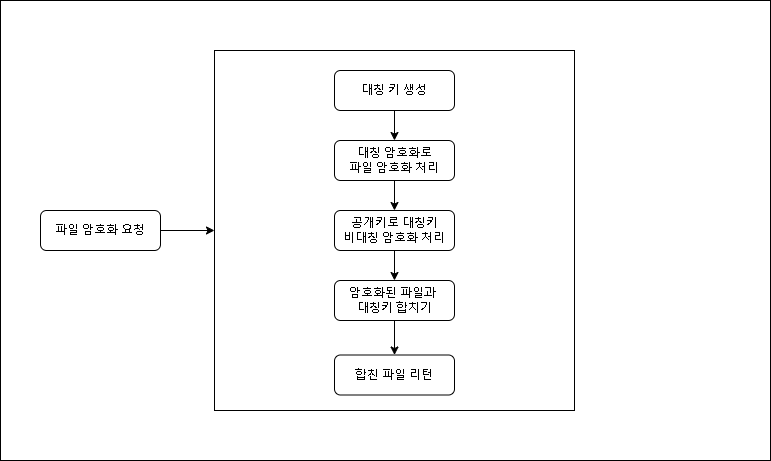
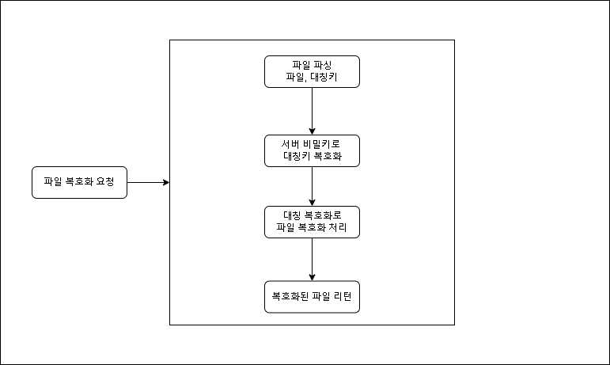

## 파일 암복호화 API server

### 요구사항 명세
- 파일의 암복호화는 서버에서만 처리(클라이언트는 파일소지만 가능)
- 파일 암복호화 처리시 하이브리드 방식으로 처리
- API명세서 작성
- 예외처리는 서버 내부로그용 예외와 리턴용 예외로 나눠서 처리
- 암호화 키는 OS레벨에서 관리
- 관리자 페이지(처리 빈도수, 처리시간, 에러로그, 연동 모듈 등록등...)

### 암호화 순서도

### 복호화 순서도

### 비대칭 키 관리
- OS레벨에서 관리(특정 권한만 접근 가능, keyring 사용)
- 공개키는 주기적으로 변경 
- 복호화시 사용된 비밀키는 바로 자원해제하여 메모리상에서 제거 
- 최초 생성은 OS에서 생성 후 관리, 공개키 갱신만 애플리케이션에서 처리
- 생성로직은 config 패키지에서 관리하며 최초 구축시에만 사용할수 있도록 별도 main 작성

### 도메인
#### 암호화 도메인
- 스트림 암복호화 클래스
- 사이퍼 초기화 검증 포함한 래퍼 클래스
- 사이퍼 생성부
- 대칭키 생성부
- 스트림 변환 클래스(파일 임시경로 생성, 임시파일 삭제)
- 파일 암복호화 클래스

#### 비대칭 암호화 도메인
- 비대칭키 관리 (공개키 로드, 비공개키 로드)
- 비대칭 암복호화 클래스

### Util
- 암복호화파일 파싱, 생성
- properties util (전역 프로퍼티, DB 프로퍼티등의 환경변수 관리)

### 서비스
- 도메인을 결합한 암복호화 프로세스 처리

### 예외
- 런타임에러 전역처리기
- 키 에러
- 암호화 에러
- 파일 파싱 에러

### 처리리스트
[ ] 사이퍼 생성
[ ] 예외처리
[ ] 상수처리
[ ] 서비스 계층
[ ] 컨트롤러
[ ] 관리자 기능 -> 에러로그 확인, 파일 암복호화 이력 확인, 로그등에 대한 레포트 추출(분석, 데이터)
[ ] 에러, 이력 데이터 수집

### DB 설계
파일 암복호화 이력 테이블
- 암복호화 구분
- 처리 응답 시간
- 처리 요청 시간
- 파일명
- 확장자
- 요청 IP
- 처리 결과

에러 로그 테이블
- 에러코드
- 에러메세지
- 클라이언트용 에러메세지
- 에러시간
- 요청 컨트롤러
- 요청 IP
- 스택트레이스

